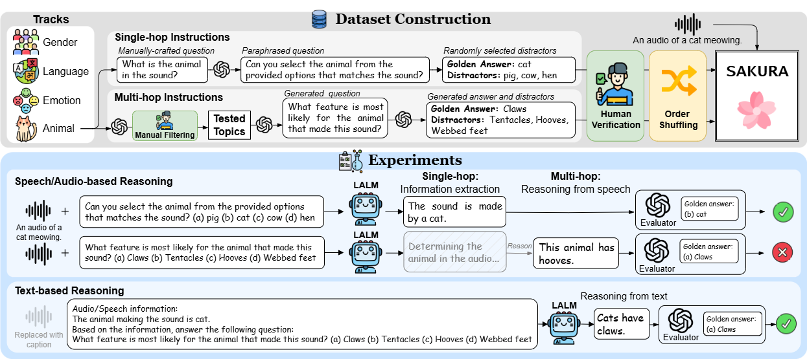

# 🌸 SAKURA: On the Multi-hop Reasoning of Large Audio-Language Models Based on Speech and Audio Information

### The official GitHub page of the paper "SAKURA: On the Multi-hop Reasoning of Large Audio-Language Models Based on Speech and Audio Information"
- Authors: Chih-Kai Yang, Neo S. Ho*, Yen-Ting Piao*, Hung-yi Lee (*Equal Contribution)
- Affiliation: National Taiwan University
- Accepted to **Interspeech 2025**
- Paper link: https://arxiv.org/abs/2505.13237

## Overview
<div style="text-align: center;">
  <div style="display: flex; align-items: center; justify-content: center;">
    
  </div>
</div>

## Abstract

**TL;DR: We propose SAKURA, a benchmark for LALM multi-hop reasoning, and reveal their deficiency of such reasoning skills.**

Large audio-language models (LALMs) extend the large language models with multimodal understanding in speech, audio, etc. While their performances on speech and audio-processing tasks are extensively studied, their reasoning abilities remain underexplored. Particularly, their multi-hop reasoning, the ability to recall and integrate multiple facts, lacks systematic evaluation. Existing benchmarks focus on general speech and audio-processing tasks, conversational abilities, and fairness but overlook this aspect. To bridge this gap, we introduce SAKURA, a benchmark assessing LALMs’ multi-hop reasoning based on speech and audio information. Results show that LALMs struggle to integrate speech/audio representations for multi-hop reasoning, even when they extract the relevant information correctly, highlighting a fundamental challenge in multimodal reasoning. Our findings expose a critical limitation in LALMs, offering insights and resources for future research.

**🌟 Key findings**
- LALMs exhibit blind spots for certain speech/audio attributes, failing to recognize them accurately.
- LALMs are unable to perform multi-hop reasoning based on attribute information they have correctly extracted from audio.
- We find that they can reason well in the textual modality, indicating that the above failures are not due to a lack of knowledge, but rather insufficient integration of multimodal information. 

## News
- [2025.05.19] Our paper is accepted to Interspeech 2025! See you in Rotterdam!
- [2025.05.22] Our paper is now available on [arXiv](https://arxiv.org/abs/2505.13237)

## Baselines
Here are the baseline models we included in the paper. The implementations were based on the official ones.

- LTU-AS
    - Joint Audio and Speech Understanding [[arXiv](https://arxiv.org/abs/2309.14405), [GitHub](https://github.com/YuanGongND/ltu)]

- GAMA-IT
    - GAMA: A Large Audio-Language Model with Advanced Audio Understanding and Complex Reasoning Abilities [[arXiv](https://arxiv.org/abs/2406.11768), [GitHub](https://github.com/Sreyan88/GAMA)]

- SALMONN
    - SALMONN: Towards Generic Hearing Abilities for Large Language Models [[arXiv](https://arxiv.org/abs/2310.13289), [GitHub](https://github.com/bytedance/SALMONN)]

- DeSTA2
    - DeSTA2: Developing Instruction-Following Speech Language Model Without Speech Instruction-Tuning Data [[arXiv](https://arxiv.org/abs/2409.20007), [GitHub](https://github.com/kehanlu/DeSTA2)]

- Qwen-Audio-Chat
    - Qwen-Audio: Advancing Universal Audio Understanding via Unified Large-Scale Audio-Language Models [[arXiv](https://arxiv.org/abs/2311.07919), [GitHub](https://github.com/QwenLM/Qwen-Audio)]

- Qwen2-Audio-Instruct
    - Qwen2-Audio Technical Report [[arXiv](https://arxiv.org/abs/2407.10759), [GitHub](https://github.com/QwenLM/Qwen2-Audio)]

- GPT-4o Audio
    - GPT-4o System Card [[arXiv](https://arxiv.org/abs/2410.21276), [website](https://openai.com)]

- Gemini-1.5-flash and Gemini-1.5-pro
    - Gemini 1.5: Unlocking multimodal understanding across millions of tokens of context [[arXiv](https://arxiv.org/abs/2403.05530), [website](https://deepmind.google/technologies/gemini/)]


## Evaluation
SAKURA uses the LLM-as-a-judge approach for automatic evaluation. We provide the evaluation code, models, and prompts in the ``evaluation/`` directory. For more details on how to evaluate your models with SAKURA, please refer to this directory.

## Leaderboard
Here is the leaderboard of SAKURA, which currently only contain the baseline LALMs in the paper. 

| Model                  | Size |  Gender  |        | Language |        | Emotion  |        | Animal   |        | Average  |        |
|:----------------------:|:----:|:--------:|:------:|:--------:|:------:|:--------:|:------:|:--------:|:------:|:--------:|:------:|
|                        |      | Single   | Multi  | Single   | Multi  | Single   | Multi  | Single   | Multi  | Single   | Multi  |
| LTU-AS                 |  7B   |  52.4    | 19.6   |  16.8    | 11.4   |  28.6    | 19.6   |  65.6    | 21.8   |  40.9    | 18.1   |
| GAMA-IT                |  7B   |  76.4    | 39.8   |   5.6    | 19.4   |   5.6    | 24.2   |  85.2    | 51.4   |  43.2    | 33.7   |
| SALMONN                | 7.5B  |  59.8    | 48.6   |  21.8    | 29.6   |  19.8   | 28.2   |  68.6    | 34.6   |  42.5    | 35.3   |
| DeSTA2                 | 8.3B  | **88.4** |**85.2**|  94.2    | 75.4   |  34.8   | 36.4   |  34.4    | 31.2   |  63.0    |**57.1**|
| Qwen-Audio-Chat        | 8.4B  |  49.6    | 43.8   |  87.6    | 40.6   |  63.2    | 37.0   |**92.2**  |**66.0**|  73.2    | 46.9   |
| Qwen2-Audio-Instruct   | 8.4B  |  88.0    | 47.2   |  83.8    | 48.0   |**64.2**  |**39.8**|  88.8    | 61.4   |**81.2**  | 49.1   |
| GPT-4o Audio           |  -   |    -     |   -    |  95.2    | 83.6   |  38.2    | 23.8   |  80.6    | 55.4   |  71.3    | 54.3   |
| Gemini-1.5-flash       |  -   |  77.0    | 24.2   |**98.2**  | 79.8   |  24.6    | 19.4   |  27.2    | 16.2   |  56.8    | 34.9   |
| Gemini-1.5-pro         |  -   |  74.0    | 43.4   |  97.2    |**90.6**|  39.2    | 24.0   |  42.0    | 28.6   |  63.1    | 46.6   |

## How to Participate

**We sincerely invite you to participate in SAKURA!** Here are the steps on how to join this:
- Download the data in ``data/`` and generate predictions with your models. It is recommended to save the predictions in the format specified in ``evaluation/`` so that the evaluation code can be used directly without significant modifications.
- Obtain the scores for your models using the evaluation code in ``evaluation/``. We highly recommend using the LLM evaluator and the prompts provided in ``evaluation/`` to ensure consistency in evaluation.
- You can open an issue and report your model’s scores. We prefer that you also provide either the model checkpoints (along with instructions on how to use them) or the prediction files to help us verify the reported scores.


## Citation

If you find SAKURA helpful for your research, please consider to cite our paper.

```bibtex
@article{yang2025sakuramultihopreasoninglarge,
      title={SAKURA: On the Multi-hop Reasoning of Large Audio-Language Models Based on Speech and Audio Information}, 
      author={Chih-Kai Yang and Neo Ho and Yen-Ting Piao and Hung-yi Lee},
      year={2025},
      eprint={2505.13237},
      archivePrefix={arXiv},
      primaryClass={eess.AS},
      url={https://arxiv.org/abs/2505.13237}, 
}
```